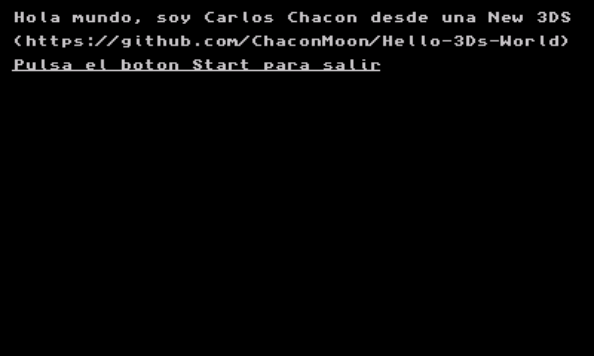

# Hello 3Ds World

Este proyecto es un Hello World personal con el que busco aprender lo basico de trabajar con el software de una 3Ds empezando por crear un Hello World y ayudar a otros a entenderlo.



## Compilar el proyecto

### Estructura del proyecto

```bash
.
├── .devcontainer # Carpeta que contiene la configuración de los contenedores de desarrollo.
│   └── devcontainer.json # Configuración del contenedor de desarrollo.
├── icon.png # Icono  de la aplicación
├── Makefile # El Makefile, esta modificado para empaquetar la aplicación y dejarla lista para subirla a la 3DS
├── README.md # Este documento
├── source # Carpeta que contiene el código del proyecto, no puede renombrarse.
│   └── main.c # Modulo principal del proyecto, y el único
└── .vscode # Carpeta con la configuración de visual Studio Code.
    └── c_cpp_properties.json # Carpeta que contiene la configuración del proyecto, te la dejo por si la necesitas.
```

### Clona este repositorio

```bash
git clone https://github.com/ChaconMoon/Hello-3Ds-World
```

### El contendor de desarrollo (método recomendado por los desarrolladores)

Este proyecto esta pensado para desarrollarse desde **Visual Studio Code** usando un contenedor de desarrollo.
*Un contenedor de desarrollo nos permite tener un entorno de trabajo dentro de un contenedor de Docker y trabajar dentro de él*
[Los kits de desarrollo de Devkitpro se distribuyen como un contenedor de Docker que ofrecen todas las utilidades necesarias para desarrollar](https://hub.docker.com/u/devkitpro), de hecho en su GitHub dice que es el metodo de desarrollo necesario.

Para trabajar con contenedores de desarrollo en necesario usar [la extensión Dev Containers de Visual Studio Code](https://marketplace.visualstudio.com/items?itemName=ms-vscode-remote.remote-containers), puedes instalarla con el siguiente comando.

Puedes instalarla con este comando si tienes code en el PATH.

```bash
code --install-extension ms-vscode-remote.remote-containers
```

Abre el repositorio en Visual Studio Code, habre la terminal de comandos con `Ctrl+Shift+P` y pon el siguiente comando.

```vscode
> Dev Containers: Reopen in Container
```

Visual Studio cargará el contenedor según la configuración especificado en el `devcontainer.json` y gracias al `c_cpp_properties.json` tendras el intel funcionando

### Instalación manual

Si deseas instalarlo en Linux manualmente puedes usar [su instalación basada en pacman](https://github.com/devkitPro/pacman/releases/tag/v6.0.2)

En el caso de los dispositivos Windows puedes usar su instalación desde [su Getting Started](https://devkitpro.org/wiki/Getting_Started)

> [!NOTE]
>Tienes que configurar manualmente el intel según tu sistema, puedes buscar como hacerlo según tu sistema operativo en el Getting Started 


### Crear el ejecutable.

Lanza el Makefile.

```
make
```

El paquete se exporta en `./dist/`

esto exportará el ejecutable `.3dsx` listo para usarse en una consola 3DS o en un emulador como [Azahar](https://github.com/azahar-emu/azahar)

puedes limpiar la compilación con:

```
make clean
```

## Explicación del proyecto

Este software se ha creado usando las librerias éstandar de input / output de C, la librería de cadenas de texto y la libería de devkitpro de 3DS.

Aqui tienes el software comentando.

```C
/* Libería estándar de Input / Output */
#include <stdio.h>

/*Librerías estándar de C*/
#include <stdlib.h>

/* Librería necesaria para la manipulación de arrays de caracteres*/
#include <string.h>

/* Libería con los las utilidades necesarias para trabajar con la 3DS*/
#include <3ds.h>

int main(int argc, char *argv[])
{
        /* Inicializa losservicios gráficos de la consola en el chip PICA200 */
        gfxInitDefault();

        /* Inicializa la interfaz de consola en la pantalla superior */
        consoleInit(GFX_TOP, NULL);

        printf("\x1b[2;2HHola mundo, soy Carlos Chacon desde una New 3DS \x1b[4;2H(https://github.com/ChaconMoon/Hello-3Ds-World)\x1b[6;2H\x1b[4mPulsa el boton Start para salir");

        // Main Loop

        /* Ejecuta el loop del programa hasta que el programa se cierre*/
        while (aptMainLoop())
        {
                /* Pausa la ejecución del programa brevemente hasta que se termine de refrescar la pantalla */
                gspWaitForVBlank();

                /*
                La 3DS utliza un sistema de doble buffer al procesar gráficos, es decir mientras mostramos un buffer estamos creando el siguiente.
                Con esta función cambiamos los buffers de modo que en el que estamos trabajando se muestra y el que se muestra pasa a ser en el que trabajamos.
                */
                gfxSwapBuffers();

                /* Escanea las pulsaciones de los botones*/
                hidScanInput();

                /* Obtiene el valor de 32 bits que obtiene el estado de todos los botones de la 3DS*/
                u32 buttonPresed = hidKeysDown();

                /* Comprobamos si el bit correspondoente al botón start esta activado gracias a una operación AND,
                si es cierto devolvera un valor distinto de cero y la condición será verdadera*/
                if (buttonPresed & KEY_START)
                        break; // Terminar la ejecicón del programa
        }
        /* Libera el buffer de memoria del video, de no hacerlo la consola podría presentar problemas gráficos al volver al menú principal*/
        gfxExit();
        return 0;
}
```